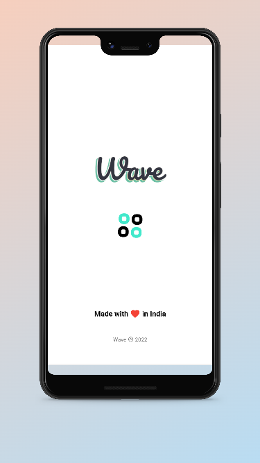
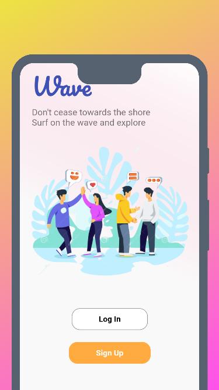
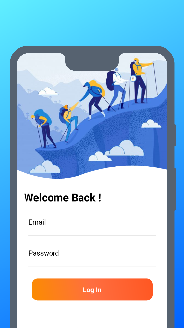
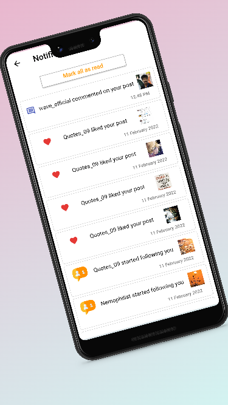
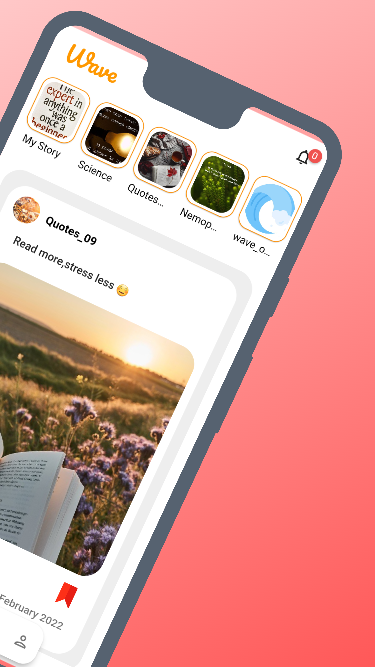
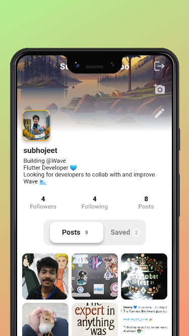
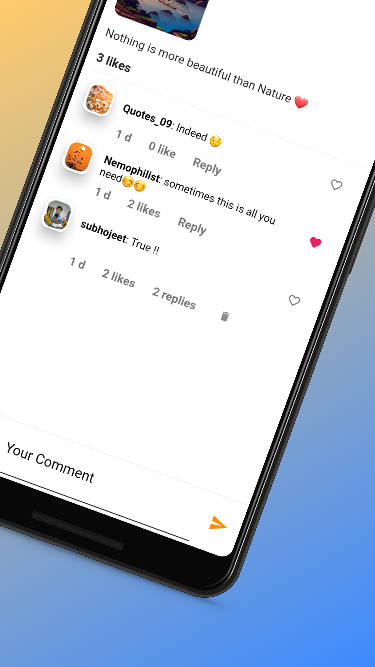

# Wave
  

## Download

<a href='https://play.google.com/store/apps/details?id=com.Alpha.nexus'></a>

## About
- An android app developed with Flutter and Dart. Uses Firebase for back-end services such as Authentication, Database ( No SQL ) and Storage.
- The app intends to connect people around the globe.
- It comes with several other alluring attributes such as receiving likes and comments on the contents that have been put up , also being able to reciprocate the same.
- The search option helps to explore and give the upper hand in finding anyone, also following and unfollowing is made convenient for the user. The inbox holds the chat heads of the conversation, simply letting the user chat with the person of their interest.
- An indispensable feature provides an Encryption that makes the conversations undecipherable.

## Snaphots                                              
 ||  ||  ||    ||  ||  ||  

### Dont forget to :star: the repo

## License
```
Copyright © 2022 Subhojeet Sahoo

Being Open Source doesn't mean you can just make a copy of the app and upload it on playstore or sell
a closed source copy of the same.
Read the following carefully:
1. Any copy of a software under GPL must be under same license. So you can't upload the app on a closed source
  app repository like PlayStore/AppStore without distributing the source code.
2. You can't sell any copied/modified version of the app under any "non-free" license.
   You must provide the copy with the original software or with instructions on how to obtain original software,
   should clearly state all changes, should clearly disclose full source code, should include same license
   and all copyrights should be retained.

In simple words, You can ONLY use the source code of this app for `Open Source` Project under `GPL v3.0` or later
with all your source code CLEARLY DISCLOSED on any code hosting platform like GitHub, with clear INSTRUCTIONS on
how to obtain the original software, should clearly STATE ALL CHANGES made and should RETAIN all copyrights.
Use of this software under any "non-free" license is NOT permitted.
```

See the [MIT License](https://github.com/Alpha17-2/Wave/blob/master/LICENSE) for more details.

## Packages
- http - https://pub.dev/packages/http
- provider - https://pub.dev/packages/provider
- cached_network_image - https://pub.dev/packages/cached_network_image
- comment_box - https://pub.dev/packages/comment_box
- liquid_pull_to_refresh - https://pub.dev/packages/liquid_pull_to_refresh
- scrollable_positioned_list - https://pub.dev/packages/scrollable_positioned_list
- flutter_image_compress - https://pub.dev/packages/flutter_image_compress
- shared_preferences - https://pub.dev/packages/shared_preferences
- flutter_slidable - https://pub.dev/packages/flutter_slidable
- intl - https://pub.dev/packages/intl

## Requirements

* Dart sdk: ">=2.12.0-0 <3.0.0
* [Flutter ">=2.5.3"](https://flutter.dev/docs/get-started/install)
* Android: minSdkVersion 17 and add support for androidx (see AndroidX Migration to migrate an existing app)

## Get Started

* Fork the the project
* Clone the repository to your local machine 
* Checkout the master branch
* You will encounter errors because some files are missing .
* Download the constant file from the link and place it inside lib/utils/  -  https://gist.github.com/Alpha17-2/787865f34158397b7e4ed52c96b05d21
* Download the encrypt_message file from the link and place it inside lib/utils/ - https://gist.github.com/Alpha17-2/70f2ea8064522751bd5b3b0914f7e8ad

## Running the project with Firebase

- Create a new project with the Firebase console.
- Add Android app in the Firebase project settings.
- On Android, use `com.Alpha.nexus` as the package name.
- then, [download and copy](https://firebase.google.com/docs/flutter/setup#configure_an_android_app) `google-services.json` into `android/app`.


See this document for full instructions:
- [https://firebase.google.com/docs/flutter/setup](https://firebase.google.com/docs/flutter/setup) 

## Setting up Firebase for backend services (Authentication , database and storage )

- Go to Firebase authentication section and enable Email/Password method for authentication
- Go to Firebase Realtime database and create a new database in test mode . Copy the API url and paste it into `lib/utils/constants.dart` . 
- Go to Firebase Firestore database and create a new database in test mode.
- Go to Firebase Firestore Storage and create a new database in test mode.

## Facing any Issue?

Have a look at some [common Issues](https://github.com/Alpha17-2/Wave/issues) that you might face. If your problem is not there, feel free to raise an issue :)


## Contribute

- Check out the issues .
- Comment 'want to work on this' to work on the particular issue and wait for admin to assign you with the task.
- Create a new branch with name dev-pr.
- Add your new changes.
- Commit the required changes ( Commit message should be understandable ) 
- Do not commit the files you created : 
     - google-services.json
     - constants.dart
     - encrypt_message.dart
- Create new Pull Request

## Get in touch

- [](https://twitter.com/subhojeet_sahoo)
- [](https://www.instagram.com/alpha__77__/)
